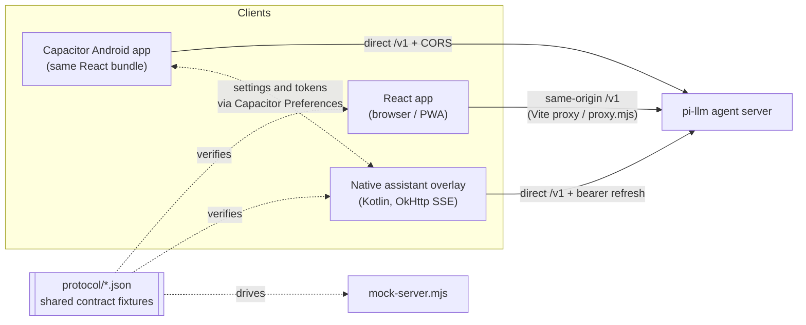

# Ember

[](https://github.com/txchin0/ts-llm-frontend/actions/workflows/ci.yml)
[](LICENSE)

Ember is the chat client for [pi-llm](https://github.com/txchin0/pi-llm), a self-hosted
personal-assistant backend that runs on local LLMs. A single React codebase ships as an
installable **PWA** and as a **Capacitor Android app**. The Android app can also replace the
phone's **digital assistant**: the assist gesture opens a native voice overlay that talks to
your own agent server.

<!-- TODO: add a screenshot or GIF of the chat UI and the assistant overlay -->

## Features

- **Streaming chat over SSE.** Answers render as markdown while they stream. The model's
  reasoning appears in a collapsible "Thinking" panel, and tool calls and results show up
  as expandable chips.
- **Background tasks.** A tasks panel shows the work the agent has deferred to its worker,
  with live status and recent results. Finished tasks can be dismissed.
- **Integrations.** Users can turn integrations (web search, Google Calendar, Google Tasks)
  on or off, and connect Google accounts through an OAuth flow.
- **Accounts.** Password sign-in, with bearer access tokens and rotating refresh tokens.
- **Voice.** Dictation in the composer and a hands-free conversation mode. Both use the
  Web Speech API in browsers and a native speech plugin on Android, behind one engine
  interface.
- **Android assistant overlay.** A fully native Kotlin implementation, without a WebView:
  an animated flame reacts to your voice, the reply streams above it, and the mic re-arms
  for follow-ups. See [docs/android-assistant.md](docs/android-assistant.md).
- **Polish.** Light, dark and system themes, safe areas on phones, an installable PWA, and
  no conversation persistence.

## Architecture



### Contract fixtures

The wire protocol is written three times: TypeScript for the web, Kotlin for the
assistant overlay, and the mock server. These copies used to drift apart. Now the
canonical spelling lives in [`protocol/`](protocol) as JSON fixtures covering endpoints,
SSE event vocabulary and the web↔native handshake:

- the web app imports its path constants straight from the JSON;
- the mock server is driven by the same fixtures;
- Kotlin unit tests fail if their local constants differ from the fixtures.

To change the protocol, edit the fixture first, and the failing tests show every side
that needs updating.

### Notes

- **Web↔native handshake.** The web app mirrors the server URL, mic language and token
  pair into Capacitor Preferences. The native assistant reads them from the same store, and
  writes rotated tokens back after a refresh, so both clients stay signed in without racing
  each other.
- **Speech engine strategy.** `SpeechInputEngine` hides the browser and native recognizers behind
  one interface, which handles transcript accumulation and keep-alive restarts.
- **Pure streaming reducer.** SSE events are folded into the transcript by a pure,
  unit-tested reducer (`chatStreamReducer.ts`), which keeps React state handling simple.

## Tech stack

React 19 · TypeScript · Vite · CSS Modules · Server-Sent Events · Capacitor 8 · Kotlin
(Android voice interaction service) · OkHttp · vite-plugin-pwa · Vitest + Testing Library ·
ESLint

## Getting started

**Prerequisites:** Node.js 22 or later, and a running [pi-llm](https://github.com/txchin0/pi-llm)
server (default `http://127.0.0.1:3000`). You can use the bundled mock server instead
(see below).

```bash
npm install
cp .env.example .env   # optional; set VITE_TS_LLM_TARGET to point at your server
npm run dev            # http://localhost:5173
```

In development, Vite proxies `/v1` to the agent server. The dev server binds to all
interfaces, so you can open the printed Network URL on a phone on the same network.

### Without the backend (mock server)

[`mock-server.mjs`](mock-server.mjs) implements the real auth model (register, login,
refresh rotation, 401s) and streams representative turns from the protocol fixtures:

```bash
node mock-server.mjs                                   # terminal 1 (port 3001)
VITE_TS_LLM_TARGET=http://127.0.0.1:3001 npm run dev   # terminal 2
```

## Android app

Requires Android Studio, JDK 21, and the Android SDK. The `android/` project is
committed.

```bash
npm run cap:sync   # native web build (no service worker) + cap sync
npm run cap:open   # open in Android Studio to build and run
```

In the app, set **Settings → Agent server** to `http://<server-lan-ip>:3000`. The WebView
calls the server directly from origin `http://localhost`, so pi-llm must allow that origin
(`CORS_ALLOWED_ORIGINS`). `CapacitorHttp` stays disabled because it can't stream responses.

To use the assistant overlay, pick Ember under **Settings → Apps → Default apps → Digital
assistant app**, and sign in to the app once. See
[docs/android-assistant.md](docs/android-assistant.md) for details.

**Known gap:** the OAuth "Connect" button opens the system browser, but returning to the
app isn't wired up yet (deep links are still to do).

## Production (web)

```bash
npm run build   # type-check + build to dist/
npm run serve   # serves dist/ and reverse-proxies /v1 (PORT, HOST, TS_LLM_TARGET)
```

You can use your own reverse proxy instead. In that case, serve `dist/` statically and
forward `/v1` with buffering disabled so SSE streams in real time:

```nginx
location /v1/ {
    proxy_pass http://127.0.0.1:3000;
    proxy_http_version 1.1;
    proxy_set_header Connection "";
    proxy_buffering off;
    proxy_read_timeout 1h;
}
```

## Testing

```bash
npm test                        # web unit + component tests (Vitest)
npm run lint
android/gradlew -p android test # Kotlin unit + contract tests
```

## Project structure

```
src/
  api/         HTTP + SSE clients, auth/token handling, endpoint constants
  state/       hooks (chat, auth, tasks, settings, hands-free) + stream reducer
  voice/       SpeechInputEngine interface with Web Speech and native implementations
  native/      Capacitor Preferences mirror for the web↔native handshake
  components/  UI components (CSS Modules)
  brand.ts     product metadata + PWA manifest source
protocol/      canonical contract fixtures (endpoints, SSE events, handshake)
android/       Capacitor project + native assistant (app/ember/mobile/assist)
docs/          Android assistant design notes
PRODUCT.md     product strategy and voice
DESIGN.md      visual system: palette, type, motion
proxy.mjs      production static server + /v1 reverse proxy
mock-server.mjs  fixture-driven mock of the agent server
```

## License

[MIT](LICENSE)
