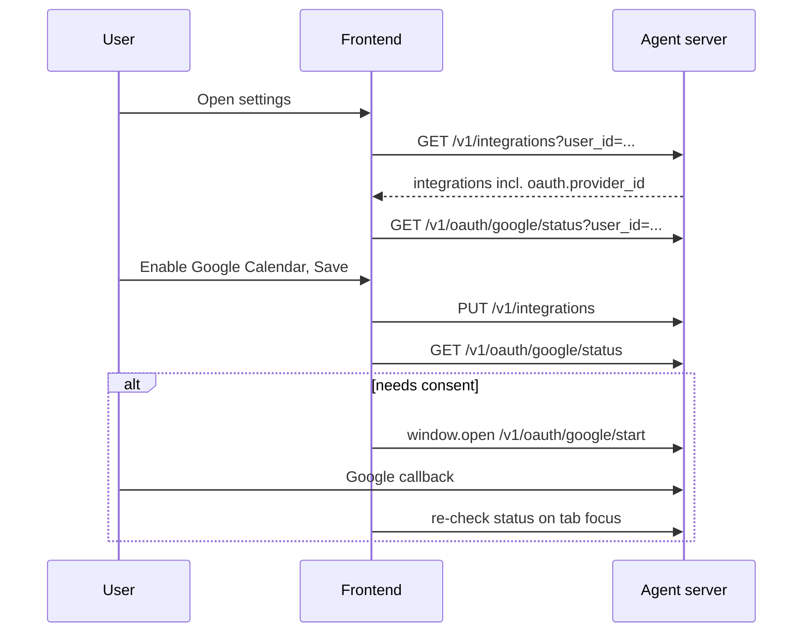

# Server handoff: Google OAuth + integrations API

Brief requirements for the agent server (pi-llm) so the ts-llm-frontend can support Google Calendar and future OAuth-backed integrations.

**Consumer:** [ts-llm-frontend](..) settings UI (integration toggles + connect/disconnect).

**Reference implementation:** pi-llm (`e:\Projects\pi-llm`) already has most OAuth routes; one contract extension is required.

---

## Summary

| Area | Status in pi-llm | Action needed |
|------|------------------|---------------|
| `GET/PUT /v1/integrations` | Works; no OAuth metadata | **Add `oauth.provider_id` to response** |
| `GET /v1/oauth/:providerId/status` | Implemented | Ensure deployed + env configured |
| `GET /v1/oauth/:providerId/start` | Implemented | Ensure deployed + env configured |
| `GET /v1/oauth/:providerId/callback` | Implemented | Redirect URI must match proxy origin |
| `DELETE /v1/oauth/:providerId` | Implemented | No change |

---

## 1. Required change: expose OAuth on integration list

The frontend must know which integrations need OAuth **without hardcoding ids**. Internal `IntegrationDefinition` already has `oauth.providerId`; the public list endpoint strips it today.

### Extend `IntegrationSummary` (`GET` and `PUT /v1/integrations`)

Add an optional field, present only when the integration declares OAuth:

```json
{
  "id": "google_calendar",
  "label": "Google Calendar",
  "default_enabled": false,
  "enabled": false,
  "oauth": {
    "provider_id": "google"
  }
}
```

Non-OAuth integrations (e.g. `web_search`) omit `oauth` entirely.

### Implementation (pi-llm)

**File:** `src/contracts/integrations.ts`

1. Add schema:

```typescript
export const IntegrationOAuthSummarySchema = z
  .object({
    provider_id: z.string(),
  })
  .strict();
```

2. Add optional `oauth` to `IntegrationSummarySchema`.

3. Update `toIntegrationSummary`:

```typescript
...(definition.oauth !== undefined
  ? { oauth: { provider_id: definition.oauth.providerId } }
  : {}),
```

**Tests to update:**

- `tests/integration/integrations-route.test.ts` — `google_calendar` entry includes `oauth`
- `tests/integrations/integrationService.test.ts` — same expectation

### Do not expose

- OAuth scopes (internal, role-specific)
- Authorization URLs or tokens
- Per-integration connection status (deferred; see below)

The frontend builds the consent URL as:

```
/v1/oauth/{provider_id}/start?user_id={userId}
```

---

## 2. OAuth endpoints the frontend calls

All paths are under `/v1`. The browser talks to the **same origin** as the frontend; the dev/prod proxy forwards `/v1/*` to the agent server.

### Status — `GET /v1/oauth/:providerId/status`

**Query:** `user_id` (required, non-empty string)

**Response `200`:**

```json
{
  "connected": true,
  "granted_scopes": ["https://www.googleapis.com/auth/calendar.readonly"],
  "missing_scopes": []
}
```

- `connected`: user has stored tokens for this provider
- `missing_scopes`: scopes required by **currently enabled** integrations for this provider that are not yet granted

Called when settings open (per distinct `provider_id` from the integrations list) and after the user returns from Google consent.

### Start consent — `GET /v1/oauth/:providerId/start`

**Query:** `user_id` (required)

**Response:** `302` with `Location` set to Google’s consent screen.

Opened via `window.open` (browser navigation, not `fetch`). Scopes requested are the union of all **enabled** integrations for that provider — so the integration must be saved as enabled before consent is meaningful.

**Errors (JSON, `cache-control: no-store`):**

| Status | `code` | When |
|--------|--------|------|
| 400 | `provider_not_configured` | OAuth env vars not set |
| 404 | `provider_not_found` | Unknown `providerId` |

### Callback — `GET /v1/oauth/:providerId/callback`

**Query:** `code`, `state` (from Google redirect)

Handled entirely by the server. User sees plain text: `OAuth connected. You can close this tab.`

Not called by the frontend directly.

### Disconnect — `DELETE /v1/oauth/:providerId`

**Query:** `user_id` (required)

**Response:** `204 No Content` (deletes stored tokens; does not revoke at Google in MVP)

---

## 3. Environment and deployment

OAuth routes register only when all three variables are set:

```env
GOOGLE_OAUTH_CLIENT_ID=...
GOOGLE_OAUTH_CLIENT_SECRET=...
GOOGLE_OAUTH_REDIRECT_URI=...
```

If unset, `/v1/oauth/*` returns **404** and the frontend shows “Google sign-in is not configured.”

### Redirect URI (critical)

`GOOGLE_OAUTH_REDIRECT_URI` must be the URL **Google redirects to**, reachable on the same origin as the web app:

| Environment | Example redirect URI |
|-------------|----------------------|
| Local dev (Vite) | `http://localhost:5173/v1/oauth/google/callback` |
| Production | `https://your-app-host/v1/oauth/google/callback` |

The proxy forwards `/v1/oauth/google/callback` to the agent server. Register this exact URI in Google Cloud Console.

### Google Calendar integration id

The registered integration id is **`google_calendar`** (not `calendar`). OAuth provider id is **`google`**.

---

## 4. Frontend flow (for context)



**Order matters:** enable integration (PUT) **before** start consent, so scope aggregation includes calendar scopes.

**Trust model (MVP):** `user_id` is a client-supplied string on OAuth routes, same as chat. No login yet.

---

## 5. Explicitly out of scope (for now)

- Bundling OAuth connection status into `GET/PUT /v1/integrations` (Tier 2 — may revisit if multiple providers share rows)
- Auto-disconnect when user disables an integration
- CORS on the agent server (frontend uses same-origin proxy)
- Frontend callback page (server handles callback)

---

## 6. Checklist for server team

- [ ] `IntegrationSummary` includes optional `oauth: { provider_id }` on GET/PUT `/v1/integrations`
- [ ] `google_calendar` in registry returns `oauth.provider_id: "google"`
- [ ] Integration route + service tests updated
- [ ] Google OAuth env vars set in deployed environments
- [ ] `GOOGLE_OAUTH_REDIRECT_URI` matches proxy origin + `/v1/oauth/google/callback`
- [ ] Google Cloud OAuth client authorized redirect URI matches
- [ ] Verify `GET /v1/oauth/google/status`, `/start`, `DELETE` work behind the frontend proxy

---

## Questions

Contact the frontend owner or see the full implementation plan in the ts-llm-frontend repo (Google OAuth integration plan).
